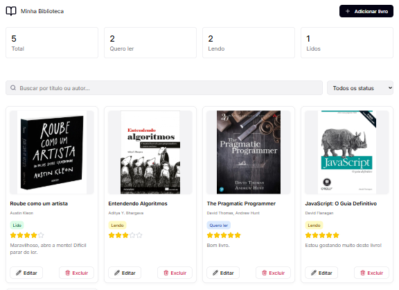

<p align="center">
  
</p>

<p align="center">
  <a href="#-projeto">Projeto</a>&nbsp;&nbsp;&nbsp;|&nbsp;&nbsp;&nbsp;
  <a href="#-tecnologias">Tecnologias</a>&nbsp;&nbsp;&nbsp;|&nbsp;&nbsp;&nbsp;
  <a href="#-layout">Layout</a>&nbsp;&nbsp;&nbsp;|&nbsp;&nbsp;&nbsp;
  <a href="#-licença">Licença</a>
</p>

<p align="center">
  
  
  
  
</p>

---

<p align="center">
  
</p>

## 💻 Projeto

**Gerenciador de Leituras** é um sistema interativo para gerenciar livros que você quer ler, está lendo ou já leu.<br>
Ele permite cadastrar, editar, excluir e filtrar livros por status, avaliação de livros com estrelas e adição de comentários.<br>
O projeto foca em **UX responsiva**, persistência de dados no **LocalStorage** e acessibilidade.<br>
É totalmente **responsivo** e funcional em **Desktop**, **Tablet** e **Mobile**.

Funcionalidades principais:

- **CRUD completo**: adicionar, editar e excluir livros.
- **Sistema de avaliação** com estrelas e botão "Limpar".
- **Busca e filtragem** por título, autor e status.
- **Estatísticas dinâmicas** de leitura.
- **Modal responsivo** com foco inicial e reset de formulário.
- **Persistência de dados** usando LocalStorage, incluindo fallback de imagens.

---

## 🚀 Tecnologias

Desenvolvido com:

- **HTML5**
- **CSS3** (Flexbox e Grid)
- **JavaScript (Vanilla)**

---

## 🔖 Layout

Visualize o layout do projeto:
<p align="center">

</p>
- Cards com título, autor, status, avaliação e comentário.<br>
- Modal interativo para adicionar ou editar livros.<br>
- Estatísticas em tempo real.

---

## 📝 Como Usar

1. Clone ou baixe o repositório.
2. Abra `index.html` no navegador.
3. Clique em **Adicionar Livro** para cadastrar livros.
4. Use **Editar** ou **Excluir** nos cards de livros existentes.
5. Pesquise e filtre livros pelo título, autor ou status, utilizando o campo de busca ou a opção de select.
6. Avalie livros com o sistema de estrelas.
7. Confira estatísticas atualizadas na página.

---

## 📁 Estrutura de Pastas

```
reading-manager/
│
├── assets/
│ ├── icons/...
│ └── images/...
│
├── js/
│ ├── main.js
│ ├── modal.js
│ ├── storage.js
│ └── ui.js
│
├── styles.css/
│ ├── form.css
│ ├── global.css
│ ├── index.css
│ ├── main.css
│ ├── reset.css
│ └── responsividade.css
│
├── .gitignore
├── index.html
├── LICENSE
└── README.md
```

---

## 📚 Aprendizados Aplicados

- Estruturação semântica de HTML e uso de ARIA.
- Layout responsivo com Flexbox e Grid.
- Manipulação do DOM e eventos com JavaScript.
- Validação de formulários e UX interativa.
- Persistência de dados com LocalStorage.
- Boas práticas de acessibilidade (foco, teclado, aria-labels).

---

## 👨‍💻 Autor

Desenvolvido por **Rocketseat**<br>
Adaptado e implementado por **William Milanez**<br>
📍 Pós-graduação Dev Start – Desafio Fase 2 – _Gerenciador de Leituras_

---

## 📄 Licença

Este projeto está sob a licença **MIT**.  
Este projeto é de uso educacional e livre para fins de estudo e prática pessoal.

---
